# FEA -> Generative Design

A from-scratch computational mechanics stack: finite element analysis -> topology optimization -> ML-accelerated generative design. Each phase is derived by hand, implemented in Python, and validated against analytical solutions before any complexity is added.

---

## Motivation

My motivation for this project comes from a deep love for motorsports and the engineering behind arguably the most complex machines in the world: F1 cars and hypercars. I've been an F1 fan since 2016, after attending my first race at age 10, and ever since I've been infatuated with cars and motorsports. The more I learned about the complexity of high-performance vehicle engineering, the more certain I became that I wanted to build a career in those fields.

Over the last few years I've grown increasingly interested in AI's role in the engineering and design of complex automotive systems. Czinger and their 21C hypercar -- built using additive manufacturing combined with AI-driven generative design -- especially captured my interest. I wanted to understand how they built what they built: they went from nothing to producing one of the fastest hypercars in the world in roughly six years. That manufacturing capability extends well beyond cars. Divergent, the parent company, and their DAPS platform are a major inspiration for this project -- I want to understand how they design the optimized parts now being adopted by top automotive brands.

Nuclear engineering is the other half of my motivation. My dad has spent his career in the nuclear sector, so I grew up immersed in that world, and it's become a real passion of mine -- the audacity of the concept and the elegance of the designs. Many of the same simulation, optimization, and ML strategies I'll explore here (FEA, topology optimization, surrogate modeling) are directly relevant to that field, which is part of why this project is built to serve both.

---

## Project Philosophy

This project is built on three principles:

1. **Derive before coding.** Every method is worked out by hand -- weak forms, shape functions, sensitivity analysis -- before a line of code is written. The math is the point; the code is the translation.
2. **Validate relentlessly.** Each phase is checked against an analytical solution or a published benchmark. Nothing is trusted until it is verified.
3. **Build in layers.** 1D before 2D, linear before nonlinear, direct solvers before ML acceleration. Each layer rests on a foundation that has already been proven correct.

---

## Capstone Target

The project builds toward a concrete deliverable: a **topology-optimized, internally-cooled, additively-manufactured piston** for a high-output engine. This part unifies every layer of the stack — structural loading (combustion gas pressure and reciprocating inertia), thermal loading (combustion heat flux and internal oil-cooling galleries), and a geometry that can only be produced by additive manufacturing. It's the reason the roadmap includes a from-scratch thermal solver: a piston is a coupled thermal-structural problem, and optimizing one honestly requires capturing both fields.

The broader thesis is unchanged — build every layer from first principles to understand what commercial generative-design and AM tools do internally — with the application target sharpened toward propulsion and powertrain performance.

---


## Roadmap

| Phase | Topic | Status |
|:-----:|:------|:------:|
| 1 | 1D linear FEA (bar) | Complete |
| 2 | 2D linear elastic FEA (CST) | Complete |
| 3 | Thermal FEA (1D → 2D conduction → thermal-structural coupling) | Complete |
| 4 | Sensitivity analysis (adjoint method) | Complete |
| 5 | SIMP topology optimization | Complete |
| 6 | Manufacturing-constrained generative design (AM overhang, feature size) | Planned |
| 7 | ML acceleration (neural reparameterization / PINN surrogates) | Planned |

---

## Phase 1: 1D Bar FEA

A complete linear finite element solver for the 1D bar, built entirely from first principles.

### What it does

Solves the governing equation for axial deformation of a bar:
```
d/dx(EA * du/dx) + b(x) = 0,    u(0) = 0,    EA * du/dx|_{x=L} = P
```

The pipeline: build mesh -> element stiffness matrices -> global assembly -> consistent load vector -> apply boundary conditions -> solve `Ku = F` -> post-process.

### Implemented from scratch

- **Element stiffness matrix** -- derived from the weak form and Galerkin discretization with linear (tent) shape functions.
- **Global assembly** -- scattering element matrices into the global stiffness matrix via a connectivity table.
- **Consistent load vector** -- distributed body loads and point loads, derived from the shape-function projection.
- **Dirichlet boundary conditions** -- applied by direct elimination of constrained degrees of freedom.

### Validation

The solver is checked against the closed-form analytical solution. At the nodes, the FEA result matches to **machine precision** (~1e-15) -- a consequence of the nodal superconvergence property of linear elements for this problem.

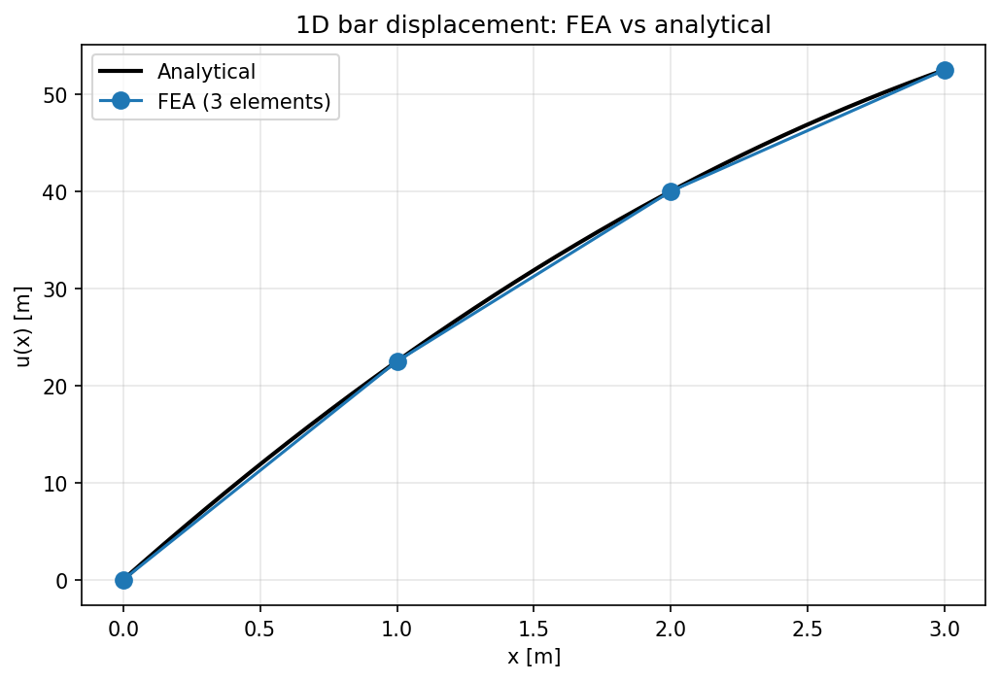

### Convergence study

A mesh-refinement study confirms the method converges at the theoretically predicted rate. For linear elements, the interpolation error scales as **O(h^2)** -- halving the element size quarters the error. On a log-log plot this appears as a straight line of slope 2, and the measured slope is **2.00**.

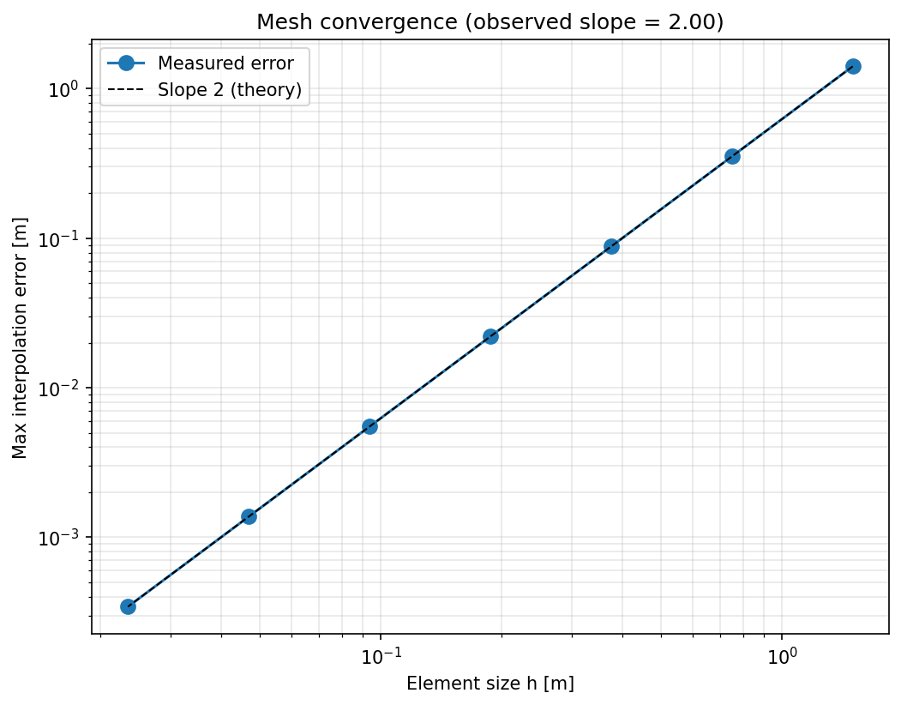

### Running Phase 1

```bash
cd phase1-1d-bar
python run_example.py     # solve the example problem and validate against analytical
python convergence.py     # run the mesh convergence study
```

---

## Phase 2: 2D Linear Elastic FEA (Constant-Strain Triangle)

A from-scratch 2D plane-stress finite element solver using constant-strain triangle (CST) elements. Generalizes the Phase 1 bar solver from a scalar 1-DOF-per-node problem to a vector 2-DOF-per-node elasticity problem.

### What it does

Solves 2D linear elasticity under plane-stress assumptions on a triangulated domain. The element stiffness is the standard
```
k = Bᵀ D B · t · A
```
where B is the 3×6 strain-displacement matrix (built from the CST shape-function gradients), D is the 3×3 plane-stress constitutive matrix, t is thickness, and A is the triangle area. The pipeline mirrors Phase 1: mesh -> element stiffness -> global assembly (2 DOFs/node) -> load vector -> boundary conditions -> solve -> post-process.

### Implemented from scratch

- **Plane-stress constitutive matrix D** -- relating the three stresses to the three strains, including Poisson coupling.
- **CST element stiffness** -- derived from the linear shape functions over a triangle; validated against four physical properties (symmetry, rank-3 deficiency for the three rigid-body modes, zero-energy rigid translation, positive semi-definiteness).
- **Global assembly** -- 2-DOF-per-node scatter via a connectivity table, generalizing the Phase 1 assembly. Validated by confirming the assembled global matrix retains exactly 3 rigid-body modes.
- **Boundary conditions and loads** -- DOF-level Dirichlet constraints (allowing per-direction fixing) and distributed edge loads.

### Validation: cantilever benchmark

The solver is tested on a clamped cantilever (length = 5× depth) under a distributed tip load, compared against Euler-Bernoulli beam theory (δ = PL³/3EI).

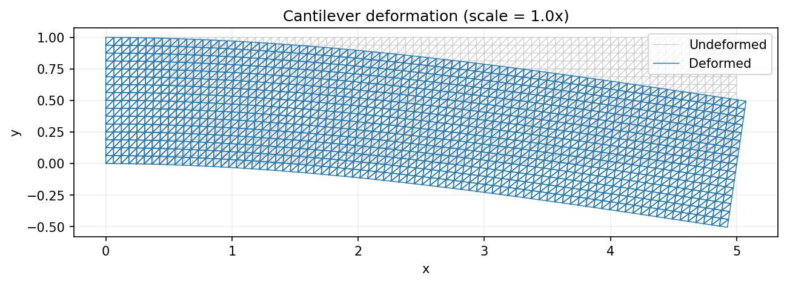

Constant strain cannot represent the linear bending-strain gradient through the depth of the beam, so when the element bends, it is forced to develop a spurious shear strain that shouldn't be there. That fake shear soaks up energy, and absorbing energy is what makes the element artificially stiff. The result is a coarse mesh that under-predicts deflection — it reports the beam as stiffer than it really is.
Refinement fixes this. A staircase of many small constant-strain triangles, each holding a slightly different constant value, approximates the smooth linear gradient — and the finer the mesh, the finer the staircase, so less spurious shear is generated and the deflection climbs toward the true value.
The converged value lands slightly above the Euler-Bernoulli line because beam theory assumes cross-sections stay perpendicular to the beam axis and ignores shear deformation entirely. Our 2D elasticity model includes it, which makes the true beam slightly more flexible. So the converged FEA settling a few percent above the beam-theory reference isn't error — it's real physics that beam theory leaves out.


### Convergence study

Unlike Phase 1, there is no exact answer to validate against, because Euler-Bernoulli is an idealization, not the true 2D solution. So we use two complementary views to show convergence.

**Plateau view:** This plots tip deflection against mesh refinement. The deflection climbs from ~0.28 (coarsest mesh, heavily shear-locked) to ~0.512 (converged), rising through and just past the Euler-Bernoulli reference of 0.500. That rise-and-cross shape is precisely the shear-locking-then-shear-deformation story: a coarse mesh is artificially stiff, refinement relieves the locking, and the converged value settles slightly above beam theory because 2D elasticity captures shear deformation that Euler-Bernoulli ignores.

| Mesh (nx×ny) | Elements | Tip deflection |
|:---:|:---:|:---:|
| 10×2 | 40 | 0.280 |
| 20×4 | 160 | 0.423 |
| 40×8 | 640 | 0.487 |
| 80×16 | 2560 | 0.507 |
| 160×32 | 10240 | 0.512 |

Euler-Bernoulli reference: **0.500**

**Self-convergence view:** With no analytical truth available, the finest mesh is used as a stand-in reference, and the error of each coarser mesh is measured against it. On a log-log plot the error falls along a clean line, running roughly parallel to the slope-2 reference — a touch steeper, measured at 1.82. It isn't exactly 2.00 because the finest mesh is itself still slightly converging, so it's an imperfect reference, and that contamination pulls the slope down a little. Even so, it confirms the second-order-ish convergence expected for CST displacement.

**Together:** the plateau confirms *what* the solver converges to (the physics), and the self-convergence confirms *how fast* (the numerics). Together they validate the solver without an exact answer — the kind of verification you'd use on any real part where no closed-form solution exists.

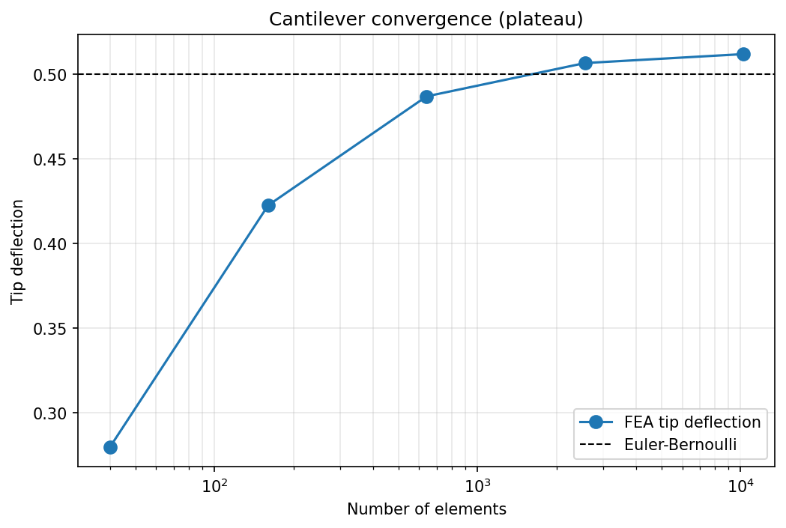
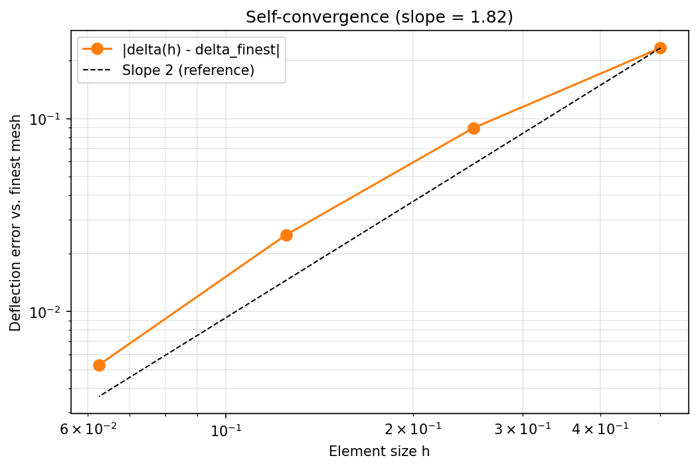
### Running Phase 2

```bash
cd phase2-2d-elasticity
python run_example.py     # solve the cantilever, save deformed mesh
python convergence.py     # plateau + self-convergence study
```


---

## Phase 3: Thermal FEA & Thermal-Structural Coupling

A from-scratch steady-state heat-conduction solver -- 1D, then 2D on the CST mesh -- culminating in **thermal-structural coupling**: joining the thermal and elasticity solvers so a temperature field produces real thermal stress and deformation. This is the multiphysics capability the piston capstone is built on.

### The core insight: thermal conduction ≡ elasticity

1D steady-state heat conduction is a direct isomorphism with the Phase 1 elasticity bar. Starting from the same weak form, you simply substitute each elasticity quantity for its thermal counterpart -- displacement → temperature, Young's modulus → conductivity, body load → heat source, internal force → heat flow rate (Fourier's law) -- and the derivation follows the identical path. The problem becomes almost exactly the one already solved in Phase 1, so the existing solver *became* the 1D thermal solver by recognizing the structure rather than rewriting it. With constant coefficients and no spatial variation in the weak-form terms, the derivation stays simple.

The one genuinely new piece versus Phase 1 is **nonzero Dirichlet BCs**. Phase 1 only ever fixed values to zero, where the constrained term contributes nothing and drops out of the system. Here, a prescribed nonzero end temperature *does* contribute: its known value, scaled by the coupling stiffness, injects a load into every neighboring equation (`F_i -= K_ij · T_j`) before the fixed row and column are eliminated. Phase 1 is the special case of this where the prescribed value is zero, so the injected load vanishes.

### Step 1: 1D heat conduction

Solves steady-state conduction in a bar:
```
d/dx(kA dT/dx) + Q = 0
```

- **Element conductivity matrix** -- `(kA/h)[[1,-1],[-1,1]]`, the Phase 1 stiffness matrix under the isomorphism (E → k).
- **Nonzero Dirichlet BCs** -- the one genuinely new piece vs. Phase 1, derived by hand and validated.
- **Validation** -- against two hand-derived analytical profiles: a linear profile (no source) and a quadratic profile (uniform source), both matching to machine precision (~1e-15) at the nodes. Convergence confirmed at **O(h²)**, slope 2.00.

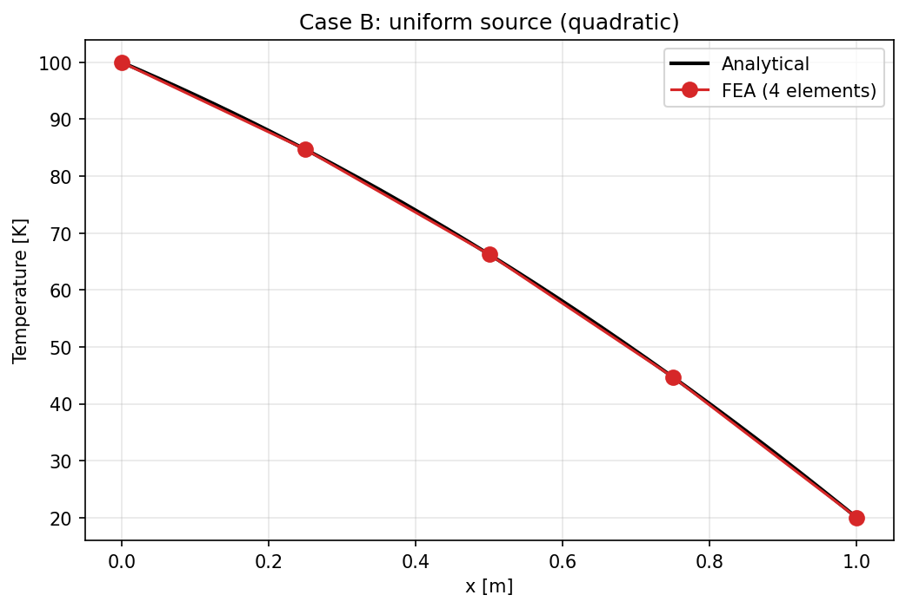

### Step 2: 2D heat conduction (CST)

Generalizes to 2D on the same triangular mesh as Phase 2. Because temperature is a **scalar** (1 DOF/node) where displacement was a vector (2 DOF/node), the element is simpler than Phase 2: a **3×3** conductivity matrix built from a **2×3** temperature-gradient matrix, with scalar conductivity replacing the 3×3 constitutive matrix.

```
k_e = Bᵀ B · k · A,    B = (1/2A) [[b1,b2,b3],[c1,c2,c3]]
```

- **Insulated boundaries for free** -- a zero-flux edge is a natural (Neumann) BC that falls out of the weak form automatically. Insulated edges require *no code*: doing nothing to a boundary enforces zero heat flux through it.
- **Validation** -- a linear-profile benchmark (insulated top/bottom, fixed sides) matches to machine precision, confirming the insulated-edge behavior. A curved **sinusoidal-edge benchmark** (exact sin·sinh solution) gives **O(h²)** convergence, slope 1.975.

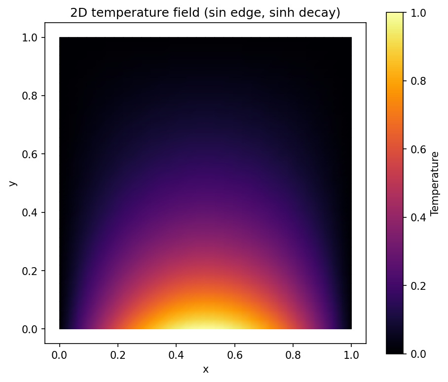

### Step 3: Thermal-structural coupling

A heated material wants to expand, which creates thermal strain. If the material is free, it expands as much as it wants and develops no stress. But if it is constrained -- physically pinned, bolted, or held back by cooler neighboring material -- that frustrated expansion produces stress. The same holds in reverse for thermal contraction under cooling. The key is that total strain splits into a mechanical part and a thermal part, and only the mechanical part -- the gap between what the material actually does and what it freely wanted to do -- produces stress: σ = D(ε_total − ε_thermal).

The bridge between the solvers is that this thermal strain enters the elasticity system as an equivalent load: Ku = F_ext + F_thermal. The temperature field computed by the thermal solver becomes a force driving the structural solver. This is exactly what the piston capstone needs -- a part that heats unevenly, is constrained, and so develops thermal stress on top of the mechanical stress from gas pressure and inertia. In a mission-critical part like a piston, both must be accounted for; thermal stress alone can cause failure.

The coupling is validated against a closed-form case -- a fully-constrained uniformly-heated block, whose exact thermal stress is `σ = -EαΔT/(1-ν)` -- matching to machine precision.

The demo below shows the pure thermal effect isolated: a cantilever with a hot-bottom/cool-top gradient and **no mechanical load** curls upward like a bimetallic strip, driven entirely by differential thermal expansion. (Shown at true scale -- thermal deformation is a large, real effect.)

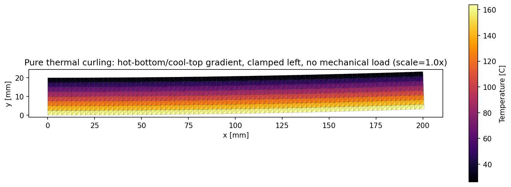

### Running Phase 3

```bash
cd phase3-thermal/1d-conduction
python run_example.py     # 1D validation (linear + quadratic profiles)
python convergence.py     # O(h²) convergence

cd ../2d-conduction
python run_example.py     # 2D sinusoidal benchmark + temperature field
python convergence.py     # O(h²) convergence

cd ../coupling
python run_example.py            # constrained-block thermal stress (validation)
python thermal_curl_demo.py      # thermal curling visualization
```

---


## Phase 4: Sensitivity Analysis (Adjoint Method)

The turning point of the project: everything before this **analyzes** a design. Sensitivity analysis is what lets an optimizer **change** one. It answers "if I nudge this design variable, how much does my objective change?" -- the gradient that topology optimization steers by.

### The problem: why the obvious approach fails

The direct method derives the sensitivity by differentiating the FEA system, giving du/dρ = -K⁻¹(dK/dρ)u, which costs an entire linear solve per design variable. If the part contains 10,000 elements, that is 10,000 solves per optimization step -- far too many, too time consuming, and downright intractable.

The thing is, we don't need du/dρ for each element. We don't need a whole displacement field per variable; we only need dc/dρ, one scalar per variable. The direct method does an enormous amount of unnecessary work, computing a full field only to crush it down to a single number at the end.

The trick is that matrix multiplication is associative. In the expression -Fᵀ K⁻¹ (dK/dρ) u, we regroup and take the left chunk (Fᵀ K⁻¹) instead of the right. That chunk has no ρ in it at all, so it can be computed once and reused for every design variable. This gives a tremendous computational payoff: the entire gradient -- all 10,000 sensitivities -- costs one extra solve instead of 10,000.


### The derivation

Differentiating the FEA system (with fixed loads, so dF/drho = 0):
```
dK/drho · u + K · du/drho = 0
```

Defining the adjoint vector λ from the reusable left chunk gives the **adjoint equation**:
```
Kᵀ λ = F
```

Because the FEA stiffness matrix is **symmetric**, this reduces to `Kλ = F` -- identical to the analysis solve `Ku = F`. So for the compliance objective, **λ = u**: the problem is *self-adjoint*, and the adjoint solution is already in hand from the analysis. The sensitivity costs *zero* extra solves.

With the SIMP-style stiffness model `K = Σ ρᵢ Kᵢ⁽⁰⁾`, the sensitivity collapses to a strikingly simple form:

```
dc/dρⱼ = -uⱼᵀ Kⱼ⁽⁰⁾ uⱼ
```

which is (twice the negative of) the **strain energy stored in element j**. Physically: the elements storing the most strain energy are where adding material helps stiffness most. That ranking is the signal topology optimization follows.

### Validation against finite differences

The analytical gradient is checked element-by-element against a brute-force finite-difference gradient (nudge each density by ε, re-solve, measure the actual change in compliance). On a 16-element cantilever with randomized densities, all elements agree to a **maximum relative error of 3.15e-06**.

That residual is *not* error in the analytical gradient -- it is the finite-difference approximation's own truncation error, which is of order ε (here ε = 1e-6). The adjoint result is the more accurate of the two; the brute-force check is the rougher reference.

### The sensitivity field

Plotting |dc/dρ| across a solid cantilever reveals the **load path**: sensitivity concentrates near the clamped edge (top and bottom fibers, which carry the bending stress) and at the load point, and falls to near zero through the lightly-loaded interior.

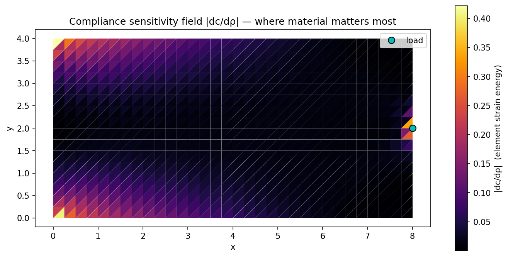

This is the map topology optimization follows -- keep material where the field is bright, remove it where it is dark.

### Running Phase 4

```bash
cd phase4-sensitivity
python sensitivity.py       # adjoint gradient vs finite differences
python plot_sensitivity.py  # sensitivity field visualization
```
---

## Phase 5: SIMP Topology Optimization

The payoff of the whole stack. Everything before this **analyzes or differentiates** a design; this phase **invents** one. Given a design domain, loads, supports, and a material budget, the optimizer decides where material should go to make the stiffest possible structure. This is generative design, built from first principles on the solvers and sensitivities of Phases 1-4.

### The problem

```
minimize    c(ρ)                    compliance (= maximize stiffness)
subject to  Σ ρᵢVᵢ = V*             material budget
            0 ≤ ρᵢ ≤ 1              densities stay physical
```

Each element gets a design variable ρᵢ (1 = solid, 0 = void). Thousands of them, driven by the adjoint gradient from Phase 4.

### Why intermediate densities must be penalized

If we let the densities be continuous, we get gradient solvability, but the optimizer then settles on intermediate densities, which are physically meaningless — you cannot have half material. The fix comes from the fact that cost scales linearly with density, while stiffness scales as ρᵖ. That divergence is the penalization.

The two-element experiment shows it directly. Fix a budget of one unit and compare gray (ρ₁ = ρ₂ = 0.5) against solid-plus-void (ρ₁ = 1, ρ₂ = 0). At p = 1 both give a total stiffness of 1 — tied, so there is no reason for the optimizer to avoid gray. At p = 3, gray gives 0.25 and solid-plus-void gives 1, so solid-plus-void is four times stiffer for the same material budget.

The mechanism is that raising a fraction to a power shrinks it disproportionately. A half-dense element costs half the budget but delivers only one eighth of the stiffness. Gray material is overpriced, so the optimizer abandons it.

### Why p = 3

A larger p penalizes harder, so why not use p = 50? Because the optimizer steers by gradients. At p = 50, 0.5⁵⁰ is an vanishingly small number and even 0.9⁵⁰ is only about 0.005. The curve is flat and pinned near zero across almost the entire range, then rises in a near-vertical cliff at ρ ≈ 1.

In the flat region the slope is essentially zero, so there is no gradient signal and the optimizer is stuck in the dark — it cannot tell which way to move an element. At the cliff the slope is nearly infinite, which is unstable and produces oscillating steps.

p = 3 is the compromise: strong enough penalization to kill gray material, and a smooth enough curve to keep the gradient informative everywhere.

### The sensitivity

Extending the Phase 4 adjoint result to the penalized stiffness model `K = Σ ρᵢᵖ Kᵢ⁽⁰⁾`:

```
dK/dρⱼ = p ρⱼᵖ⁻¹ Kⱼ⁽⁰⁾        →        dc/dρⱼ = -p ρⱼᵖ⁻¹ uⱼᵀ Kⱼ⁽⁰⁾ uⱼ
```

Setting p = 1 recovers the Phase 4 sensitivity exactly. The extra factor `p ρⱼᵖ⁻¹` scales the gradient up for already-dense elements and down for sparse ones -- the penalization is baked into the signal the optimizer steers by, not just the physics.

### The optimality criteria update

The gradient alone would drive every element to a density of 1, because adding material always helps. The material budget is what makes it a design problem: given limited material, where does it help most?

Differentiating the Lagrangian L = c(ρ) + λ(Σ ρᵢVᵢ − V*) and setting it to zero gives (1/Vⱼ)(∂c/∂ρⱼ) = −λ, with the same λ for every element. Since the right side carries no element index, every element is driven to the same benefit per unit material.

The intuition: if element A produces more stiffness per unit material than element B, you can move material from B to A and gain stiffness for free — so you were not at the optimum. Unequal benefit always leaves a profitable shuffle on the table. Only when all elements are equal does it stop. It is water finding its level.

The update uses a deal ratio Bⱼ that measures how good a deal each element is: ρⱼ(new) = ρⱼ · Bⱼ. Bargains (B > 1) grow, duds (B < 1) shrink, and elements at balance (B = 1) hold. λ is not known in advance; it is found each iteration by binary search, since total volume decreases monotonically with λ. Two guardrails keep it stable: a move limit of 0.2, which caps how far a density can shift per step, and clamping ρ between 0.001 and 1 — the small floor keeps the stiffness matrix invertible.

### Filtering: checkerboards and mesh independence

Raw SIMP produces checkerboard patterns of alternating solid and void elements. These are artifacts: the FEA formulation over-estimates the stiffness of that pattern, so the optimizer is exploiting a discretization bug rather than finding real structure.

The cause is that each element's sensitivity is purely local — it depends only on that element's own displacement and stiffness. Nothing makes an element consistent with its neighbors, so wild element-to-element alternation is possible.

The fix is to average the sensitivities over a neighborhood of radius rmin. In a checkerboard, neighbors have opposite values, so averaging washes the pattern out. In a real strut, neighbors agree, and the feature passes through the filter intact. Agreement survives smoothing; alternation does not.

The bonus is that rmin imposes a physical length scale, so the minimum feature size is set by a chosen parameter rather than by the mesh. Refining the mesh with rmin scaled accordingly converges to the same design instead of inventing ever-finer members. This also connects directly to Phase 6: "no features thinner than rmin" is essentially a manufacturing constraint — minimum printable wall thickness.

### Results: MBB beam benchmark

The MBB beam is the standard topology-optimization benchmark: a simply-supported beam with a central load, modelled as a half-domain with a symmetry plane. Starting from a uniform 50% density field on a 180×60 mesh:

| | Compliance |
|:---|:---:|
| Initial (uniform gray) | 1038.1 |
| Converged (iteration 95) | 208.6 |

**A 5× stiffness improvement using exactly the same amount of material** -- the volume constraint held at 0.500 for every iteration, so the gain comes entirely from redistribution, not addition.

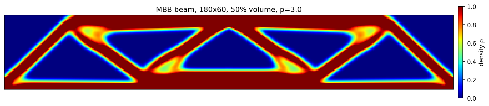

The optimizer rediscovers structural engineering unprompted: a compression chord along the top under the load, a tension chord along the bottom spanning to the supports, and triangulated diagonal web members between them. Nothing in the code knows what a truss is.

### Stress verification

Thresholding the density field to solid/void and re-solving gives the stress in the structure that would actually be manufactured (intermediate densities are a mathematical device, not a real material, so stress is only meaningful once the shape is committed).

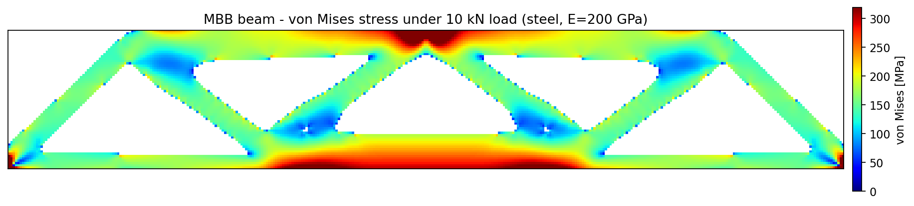

Two honest caveats:

- **The 1337 MPa peak is a point-load singularity**, not a real stress. Applying the entire load at a single node produces a theoretically infinite stress that gets *worse* with refinement. The colour scale is capped at the 98th percentile (319 MPa) so the structure remains readable; the median stress of 164 MPa is representative.
- **Thresholding changed compliance by -8.7%** (208.6 → 190.4). The thresholded structure is stiffer, because borderline elements snap to fully solid. This is an honest measure of how much the residual gray zones were contributing.

### Mesh independence in practice

Running the same problem at 60×20 with rmin = 1.5 and at 180×60 with rmin = 4.5 (the filter radius scaled with the mesh) converges to the same physical design -- c = 203.3 and c = 208.6 respectively -- rather than the finer mesh inventing thinner members. This is the mesh-independence the filter was derived to guarantee, confirmed empirically.

### Running Phase 5

```bash
cd phase5-simp
python optimize.py        # 60x20 MBB beam, fast
python optimize_fine.py   # 180x60 + von Mises stress (~40 s)
```

## Tech Stack

- **Python 3.11**
- **NumPy** -- array math, linear algebra
- **Matplotlib** -- visualization

(Later phases will add SciPy, PyTorch, and optimization libraries.)

---
- **NumPy** -- array math, linear algebra
- **Matplotlib** -- visualization

(Later phases will add SciPy, PyTorch, and optimization libraries.)

---

## License

MIT -- see [LICENSE](LICENSE).